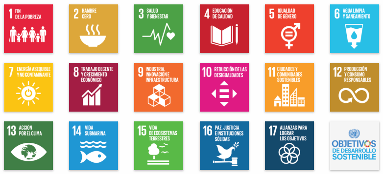

# Introducción a la Sostenibilidad

¿Qué es sostenibilidad?
La sostenibilidad es usar los recursos de manera responsable para cuidar el planeta y su futuro.

- Lista con viñetas
1. Ambiental.
2. Social.
3. Económica.

> ONU

| Nº ODS| Nombre ODS|
| ----- | --------- |
| 9     | La educación|
| 4     | La salud    |
| 3      |  Protección medio ambiente|

